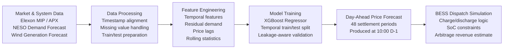
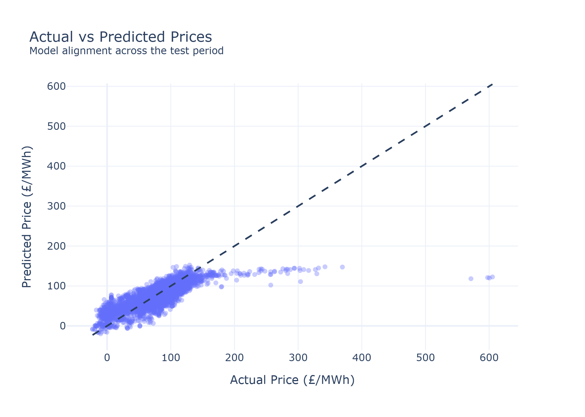
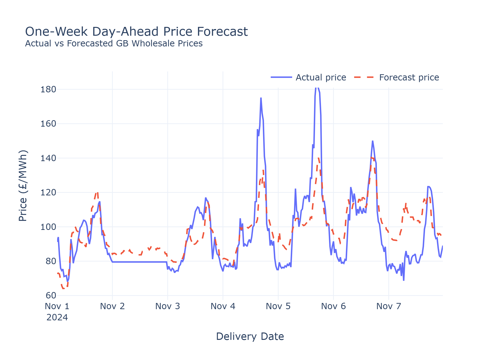
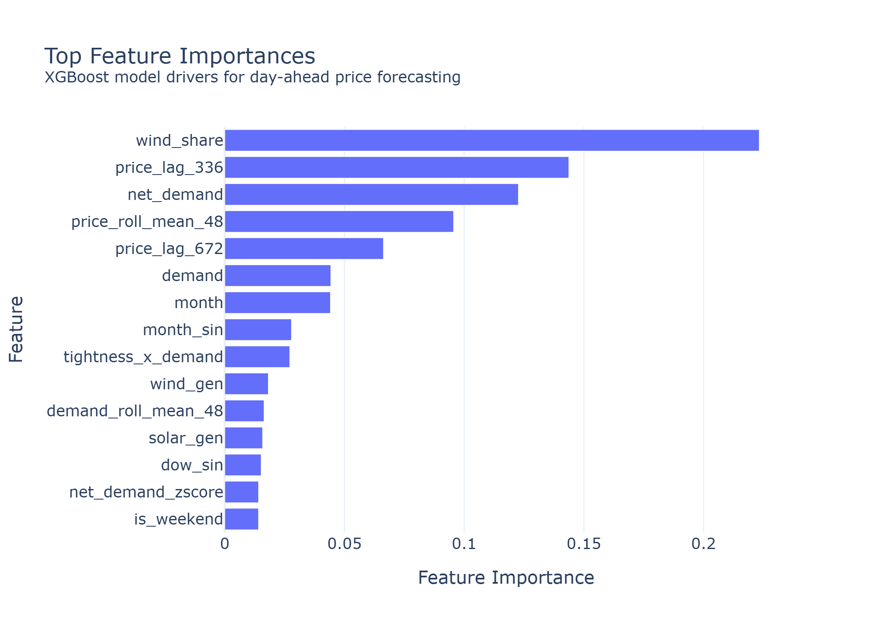
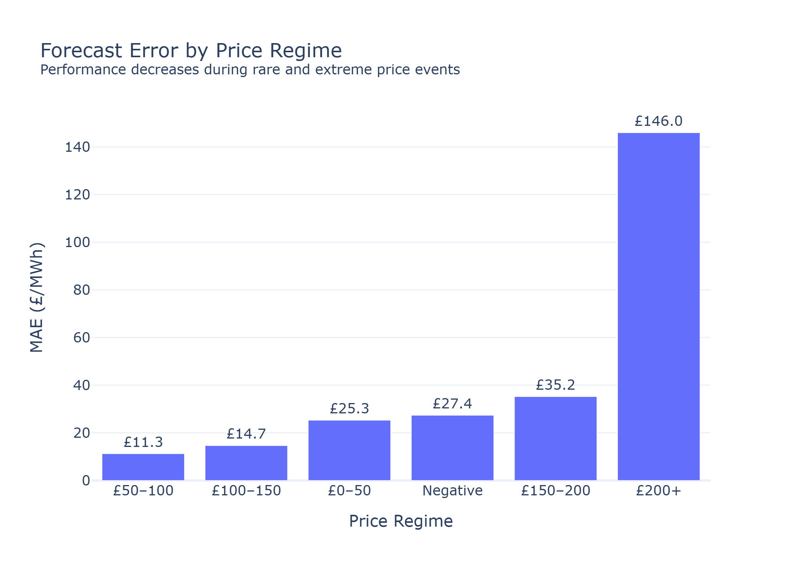

# GB Day-Ahead Electricity Price Forecasting for BESS Arbitrage
## Project Overview

Battery Energy Storage Systems (BESS) can generate revenue by exploiting price differences in electricity markets through energy arbitrage. In the Great Britain (GB) wholesale electricity market, energy can be bought and sold in the day-ahead (DA) auction, where market participants submit bids and offers one day before delivery.

Accurate forecasting of day-ahead electricity prices is critical for determining optimal battery charging and discharging schedules. Higher forecast accuracy enables operators to charge batteries when prices are expected to be low and discharge stored energy when prices are expected to be high, maximizing trading revenue and improving asset utilization.

This project develops a machine learning-based forecasting pipeline for GB day-ahead electricity prices using publicly available market and system data, including electricity demand, renewable generation forecasts, and historical price signals. The forecasting framework is designed to use only information available before the 10:00 AM day-ahead auction gate closure, ensuring that model predictions reflect realistic operational trading conditions.

The resulting forecasts can serve as a foundation for future battery dispatch optimization and energy trading strategies.

## Business Impact

Reliable wholesale price forecasts are a key component of algorithmic energy trading and battery optimization platforms. By improving visibility into future market prices, forecasting models can support:

* Optimal battery charging and discharging decisions
* Increased arbitrage revenue opportunities
* Reduced exposure to market volatility
* Improved operational planning for energy storage assets

While this project focuses on price forecasting, the outputs can be integrated into downstream optimization algorithms that determine the economically optimal battery dispatch strategy.

## Project Scope

This repository describes a complete Python pipeline for forecasting GB day-ahead wholesale electricity prices for use in BESS (Battery Energy Storage System) arbitrage optimisation. The pipeline fetches data from Elexon and NESO, provides information about preprocessing and feature engineering, trains XGBoost algorithm for forecast, and outputs a 48-half-hour settlement period (SP) price forecast for the next delivery day.

## Repository Structure

```text
BESSPriceForecasting/
│
├── data/                  # Raw and processed market/system data
├── notebooks/             # Exploratory analysis and modelling notebooks
├── src/                   # Modular Python pipeline
│   ├── data_processing.py
│   ├── feature_engineering.py
│   ├── model.py
│   ├── predict.py
│   ├── evaluate.py
│   └── visualization.py
│
├── requirements.txt
└── README.md

```


## Forecasting and Dispatch Pipeline

The project follows an end-to-end workflow that mirrors a realistic battery trading operation in the GB electricity market.

| Stage                           | Description                                                                                                                                                                                          |
| ------------------------------- | ---------------------------------------------------------------------------------------------------------------------------------------------------------------------------------------------------- |
| **1. Data Ingestion**           | Collected day-ahead electricity prices (Elexon MIP/APX index), National Energy System Operator (NESO) demand forecasts, and wind generation forecasts.                                               |
| **2. Feature Engineering**      | Created temporal features (hour, day-of-week, month), cyclical encodings, residual demand, lagged price variables, and rolling statistical features.                                                 |
| **3. Model Training**           | Trained an XGBoost Regressor using a time-aware train/test split to avoid data leakage and reflect real-world forecasting conditions.                                                                |
| **4. Price Forecasting**        | Generated a full 48-settlement-period day-ahead price curve using only information available before the 10:00 AM auction gate closure (D-1).                                                         |
| **5. BESS Dispatch Simulation** | Applied a rule-based battery dispatch strategy with state-of-charge (SoC) constraints to evaluate how forecasted prices could support charge/discharge decisions and energy arbitrage opportunities. |




## Data Sources
| Source                           | Dataset | What it provides |
| ------------------------------- | ---------------------------------------- | --------------------------------------------|
| **1. Elexon BMRS**           | Market Index Price (MID) | Half-hourly wholesale prices — target variable |
| **2. Elexon BMRS**      | National Demand Forecast (NDFD)| Forecast electricity demand in MW |
| **3. NESO**           | Day-Ahead Wind Forecast | Forecast wind generation in MW |

## Train/Test Split:
A strict temporal split was used without no shuffling. The most recent 20% of data form the test set, exactly replicating production conditions where the model is always trained on history and evaluated on the future.

| Split                           | Date Range | What it provides |
| ------------------------------- | ---------------------------------------- | --------------------------------------------|
| **1. Training**           | 2023-01-15 to 2024-08-09 | 27,495 SPs |
| **2. Test**      | 2024-08-09 to 2024-12-31 | 6,874 SPs |

The near-identical train and test price means (£81.3 vs £80.5) confirm there is no regime shift between the two periods used for training and testing.

## Feature Engineering

### Temporal Features
Electricity prices have strong periodic patterns at hourly, daily, and monthly timescales. Raw integer encodings (e.g. hour 0-23) create artificial discontinuities; hour 23 and hour 0 are numerically far apart but represent consecutive periods. Cyclical encoding using sine and cosine transformations wraps time into a circle, making midnight adjacent to 23:30 as it should be.

### Residual Demand Features
Residual demand is one of the most important ones, as in a merit-order electricity market, the marginal price equals the short-run marginal cost of the most expensive plant needed to clear demand. Wind has near-zero marginal cost, so when it generates, it displaces expensive thermal plants. Residual demand captures exactly how much expensive generation is needed.

`net_demand = demand - wind_forecast`

`wind_share = wind_forecast / demand`

Note: Solar generation was not available in this dataset. Solar suppresses midday prices in summer months — without it, net demand is slightly overestimated in daylight hours, which is acknowledged as a limitation.

### Lag and Rolling Features

Short price lags (1-4 SPs, i.e. 30-120 minutes) are not available at 10:00 D-1, as D-1 settlement prices are not yet finalised at auction close. Using them would constitute data leakage, the model would appear accurate in backtesting but fail in production.
The safe lags are D-7 and D-14, which exploit strong weekly periodicity in electricity demand patterns.

### System Tightness Proxies
LOLP (Loss of Load Probability) was not available in the used dataset. Two derived features approximate system tightness — the conditions under which price spikes occur:

`net_demand_zscore = (net_demand - rolling_mean) / rolling_std`

`wind_zscore = (wind_forecast - rolling_mean) / rolling_std`

`tightness_x_demand = net_demand_zscore * net_demand`

A high net_demand_zscore means the system is unusually stressed relative to recent history, capturing the non-linear spike risk that neither feature captures alone.


## Model Selection

<b>XGBoost Regressor</b> was chosen over alternative approaches for the following reasons:

Several forecasting approaches were evaluated to balance predictive performance, interpretability, and suitability for electricity price forecasting.

| Model | Captures Non-linearity | Models Feature Interactions | Assessment |
|---------|:---------:|:---------:|---------|
| Linear Regression | ❌ | ❌ | Strong baseline and highly interpretable, but unable to capture complex market dynamics and price spikes. |
| Random Forest | ✅ | ✅ | Captures non-linear relationships but exhibits higher variance and less stable forecasts. |
| XGBoost | ✅ | ✅ | Selected model. Delivered the best balance of forecasting accuracy, robustness, computational efficiency, and interpretability. |
| LSTM / Neural Network | ✅ | ✅ | Considered but not pursued due to limited data volume and increased model complexity relative to expected performance gains. |


### Why XGBoost?

Electricity prices are driven by complex interactions between demand, renewable generation, temporal effects, and historical market behaviour. XGBoost effectively captures these non-linear relationships while remaining computationally efficient and interpretable through feature importance analysis, making it a strong choice for day-ahead price forecasting.

### Model Evaluation

#### Baseline Comparison and Results
Model performance is only meaningful relative to naive baselines. Two baselines were computed on the test set:

| Model                           | MAE (GBP/MWh) | vs Naive Lag |
| ------------------------------- | ---------------------------------------- | --------------------------------------------|
| **1. Naive D-7 lag (predict last week's price)**           | 28.79 | Baseline |
| **2. Dummy mean predictor**      | 23.58 | -18% vs Naive|
| **3. XGBoost**           | 14.98 | -47% vs Naive |


### Key Visualization
#### Actual vs Predicted Price


- Prediction follows the actual price curve quite closely in normal market conditions, but in volatile market conditions, the prediction of price fails.

#### Day Ahead Forecast for One Week

- The model closely tracks the day-ahead price trend during normal market conditions.
- Forecasts capture daily peaks and troughs, while slight underestimation is observed during rapid price spikes.

#### Feature Importance


- Wind generation forecast and Historical electricity prices are the strongest predictors of future prices.
- Residual demand provides additional predictive power.
- Temporal features help capture recurring daily and weekly market patterns.


## Error analysis by Price Level

Model performance varies across different electricity price regimes. As expected, forecast accuracy decreases during rare and highly volatile market conditions.



| Price Range (GBP/MWh) | MAE (GBP/MWh) | Observations | Share of Test Set | Interpretation |
|----------------------|---------------|-------------:|------------------:|----------------|
| £50 – £100 | 11.26 | 4,337 | 63.0% | Core market conditions — strong forecasting performance |
| £100 – £150 | 14.66 | 1,479 | 22.0% | Elevated prices — reasonable accuracy |
| £0 – £50 | 25.27 | 789 | 11.0% | Low-demand / overnight periods — more challenging |
| Negative Prices | 27.39 | 164 | 2.0% | Rare over-generation events |
| £150 – £200 | 35.20 | 57 | 0.8% | Stress market conditions — tendency to underestimate prices |
| £200+ | 145.97 | 48 | 0.7% | Extreme price spikes — difficult to predict with historical features alone |

### Key Insights

- The model performs best in normal market conditions (£50–£100/MWh), which account for nearly two-thirds of all observations.
- Forecast accuracy degrades as prices become more extreme and less frequent.
- Negative prices and high-price spikes represent rare market regimes with limited historical examples.
- Extreme price events (£200+/MWh) contribute disproportionately to forecast error and may require additional exogenous features such as outage information, fuel prices, or market fundamentals.

## Day-ahead Forecasting

There is an important distinction between backtesting (evaluating historical test-set predictions) and day-ahead forecasting (producing tomorrow's price curve as it would work in production).

The forecast_day_ahead function simulates what happens at 10:00 on D-1. At this point the following information is available:

- All historical prices up to end of D-2 (used for lag and rolling features)
  
- NESO national demand forecast for delivery day D (published D-2 rolling)
  
- NESO day-ahead wind forecast for D (published approximately 09:00 D-1)
  
- Derived features: net demand, wind share, seasonality indicators

The model produces 48 half-hourly price predictions for the full delivery day. This forecast vector is then passed to the BESS dispatch optimiser.

### Forecast Performance

| Metric                           | Test Set | Day-Ahead Forecast |
| ------------------------------- | ---------------------------------------- | --------------------------------------------|
| **1. MAE**           | GBP 15.12 / MWh | GBP 22.06 / MWh |
| **2. RMSE**      | GBP 24.01 / MWh | Higher due to Spike Sensitivity |

The forecast MAE is higher than the backtesting MAE because the single-day forecast is evaluated on one specific day rather than averaged across many days. The backtesting MAE of GBP15 reflects average performance — individual days will vary above and below this figure.


## How to Run

```bash
git clone https://github.com/Saptaparnineogi/BESSPriceForecasting.git
cd BESSPriceForecasting

python -m venv venv
source venv/bin/activate  # Mac/Linux
# venv\Scripts\activate   # Windows

pip install -r requirements.txt
python src/main.py
```
```
