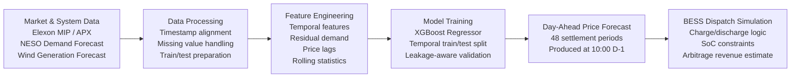

# Day ahead electricity Price Forecasting for GB
## Overview

Battery Energy Storage Systems (BESS) can generate revenue by exploiting price differences in electricity markets through energy arbitrage. In the Great Britain (GB) wholesale electricity market, energy can be bought and sold in the day-ahead (DA) auction, where market participants submit bids and offers one day before delivery.

Accurate forecasting of day-ahead electricity prices is critical for determining optimal battery charging and discharging schedules. Higher forecast accuracy enables operators to charge batteries when prices are expected to be low and discharge stored energy when prices are expected to be high, maximizing trading revenue and improving asset utilization.

This project develops a machine learning-based forecasting pipeline for GB day-ahead electricity prices using publicly available market and system data, including electricity demand, renewable generation forecasts, and historical price signals. The forecasting framework is designed to use only information available before the 10:00 AM day-ahead auction gate closure, ensuring that model predictions reflect realistic operational trading conditions.

The resulting forecasts can serve as a foundation for future battery dispatch optimization and energy trading strategies.

## Business Impact

Reliable wholesale price forecasts are a key component of algorithmic energy trading and battery optimization platforms. By improving visibility into future market prices, forecasting models can support:

* Optimal battery charging and discharging decisions
* Increased arbitrage revenue opportunities
* Reduced exposure to market volatility
* Improved operational planning for energy storage assets

While this project focuses on price forecasting, the outputs can be integrated into downstream optimization algorithms that determine the economically optimal battery dispatch strategy.

## Project Scope

This repository describes a complete Python pipeline for forecasting GB day-ahead wholesale electricity prices for use in BESS (Battery Energy Storage System) arbitrage optimisation. The pipeline fetches data from Elexon and NESO, provide information about preprocessing and feature engineering, trains XGBoost algorithm for forecast, and outputs a 48-half-hour settlement period (SP) price forecast for the next delivery day.

## Forecasting and Dispatch Pipeline

The project follows an end-to-end workflow that mirrors a realistic battery trading operation in the GB electricity market.

| Stage                           | Description                                                                                                                                                                                          |
| ------------------------------- | ---------------------------------------------------------------------------------------------------------------------------------------------------------------------------------------------------- |
| **1. Data Ingestion**           | Collected day-ahead electricity prices (Elexon MIP/APX index), National Energy System Operator (NESO) demand forecasts, and wind generation forecasts.                                               |
| **2. Feature Engineering**      | Created temporal features (hour, day-of-week, month), cyclical encodings, residual demand, lagged price variables, and rolling statistical features.                                                 |
| **3. Model Training**           | Trained an XGBoost Regressor using a time-aware train/test split to avoid data leakage and reflect real-world forecasting conditions.                                                                |
| **4. Price Forecasting**        | Generated a full 48-settlement-period day-ahead price curve using only information available before the 10:00 AM auction gate closure (D-1).                                                         |
| **5. BESS Dispatch Simulation** | Applied a rule-based battery dispatch strategy with state-of-charge (SoC) constraints to evaluate how forecasted prices could support charge/discharge decisions and energy arbitrage opportunities. |

## Data Sources
| Source                           | Dataset | What it provides |
| ------------------------------- | ---------------------------------------- | --------------------------------------------|
| **1. Elexon BMRS**           | Market Index Price (MID) | Half-hourly wholesale prices — target variable |
| **2. Elexon BMRS**      | National Demand Forecast (NDFD)| Forecast electricity demand in MW |
| **3. NESO**           | Day-Ahead Wind Forecast | Forecast wind generation in MW |

## Train/Test Split:
A strict temporal split was used without no shuffling. The most recent 20% of data forms the test set, exactly replicating production conditions where the model is always trained on history and evaluated on the future.

| Split                           | Date Range | What it provides |
| ------------------------------- | ---------------------------------------- | --------------------------------------------|
| **1. Training**           | 2023-01-15 to 2024-08-09 | 27,495 SPs |
| **2. Test**      | 2024-08-09 to 2024-12-31 | 6,874 SPs |

The near-identical train and test price means (£81.3 vs £80.5) confirm there is no regime shift between the two periods used for training and testing.

## Model Used:
